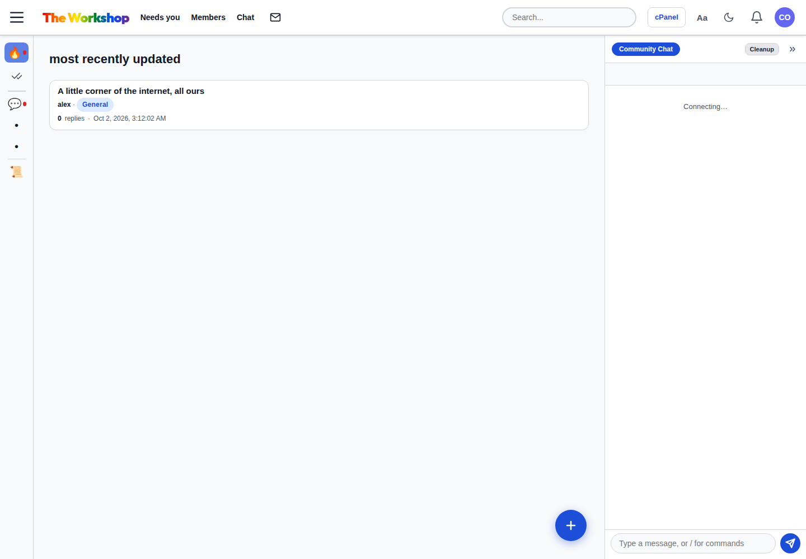

# EXTB · EXTra Board

**Your community. Your Cloudflare account.**

**[Create your community with EXTB](https://extb.achiron.fyi)**

A proper forum. Live chat. Private messages. An admin panel. All in one small, open source app you can make your own.

Start a club, a creator community, a project home, or the little corner of the internet you wish existed. Give it a name, invite your people, and start talking.

No server to rent. No Docker stack to babysit. No email provider required to get started. The core uses Cloudflare Workers, D1, and SQLite Durable Objects, with free tiers available for all three.

## Get your own community

**[Open the EXTB web installer](https://extb.achiron.fyi)** — Continue with Cloudflare, describe your community, preview its starter content, then create your owner account directly on your forum. GitHub is optional. Choose from five presets in English or Hebrew, with public reading and invitation-based participation.

The installer implementation is available; public launch requires operator OAuth/domain configuration and separate-user validation. See [installer launch status and configuration](docs/WEB_INSTALLER.md). Installation time has not yet been measured with a separate Free-plan user.

[](https://deploy.workers.cloudflare.com/?url=https://github.com/royachiron/extb)

The **Deploy to Cloudflare** button remains a secondary manual path. It requires GitHub and a private `SETUP_PASSPHRASE` of at least 16 characters. After deployment, open `/setup` and create your admin username, password, and community name. Manual setup preserves its four empty starter rooms.

Open **Admin → Invitations** to invite your first members. Each installation owns its accounts, database and conversations. The deploy command applies migrations without reapplying starter content. See [manual installation](docs/INSTALLATION.md) and [verification status](docs/VERIFICATION.md).

## Small app. Real community tools.

| What you need | What EXTB gives you |
| --- | --- |
| Conversations that last | Discussion rooms, topics, replies, Markdown, search, reactions, and polls |
| A place to hang out | Live WebSocket chat, reply context, reactions, and a persistent chat dock |
| Quiet conversations | Private messages and member profiles |
| Your own identity | Community name, description, logo URL, accent color, homepage copy, and editable rules |
| Control over the doors | Single-use invites, member roles, private spaces, and per-member room permissions |
| Practical moderation | Reports, warnings, bans, appeals, content review, and audit history |
| Admin work from an agent | Built-in MCP tools with scoped, revocable tokens |

The interface supports full page navigation and HTMX updates, desktop and mobile layouts, Hebrew RTL and English LTR with a persistent language switch, and light and dark themes. Email and image uploads are optional upgrades.



## Own the whole thing

Each deployment belongs to its operator. There is no shared EXTB service account and no central community database. Your Cloudflare account runs the app. An optional GitHub copy holds the code. MIT licensing lets you change it, brand it, and build on it.

The stack is straightforward: TypeScript on Workers, SQL in D1, room state and password hashing in SQLite Durable Objects, and server-rendered HTML. WebSocket hibernation lets idle chat rooms sleep.

Password hashing runs in a stateless Durable Object, keeping strong PBKDF2 outside the Free plan HTTP CPU budget. Passwords are never stored there.

## Free to start, within real limits

The core configuration does not require R2, Cloudflare Images, a custom domain, or an email subscription.

Current Cloudflare Free allowances include **100,000 Worker requests/day**, **5 million D1 rows read/day**, **100,000 D1 rows written/day**, and **500 MB per D1 database, 5 GB total D1 storage**. SQLite Durable Objects also have free request, compute, and storage allowances. These are account-wide limits, not a guarantee of community size. Chat, background requests, and query scans all consume resources.

Check your dashboard as your community grows. Free limits can stop requests or database queries until they reset. Paid plans and optional services have separate costs. Review [Workers limits](https://developers.cloudflare.com/workers/platform/limits/), [D1 pricing](https://developers.cloudflare.com/d1/platform/pricing/), and [Durable Objects pricing](https://developers.cloudflare.com/durable-objects/platform/pricing/) for current terms.

## Give your admin an MCP connection

Create a token under **Admin → MCP tokens**, select its permissions, and connect an MCP client to:

```text
https://YOUR-COMMUNITY.workers.dev/mcp
Authorization: Bearer YOUR_PRIVATE_TOKEN
Transport: Streamable HTTP
```

Then ask it to:

- Create a Projects room and an Announcements room.
- Update the community name, colors, and rules.
- Preview starter content and append an explicitly approved draft without overwriting existing discussions.
- Review reports and issue a moderation warning.
- Show membership and conversation totals.

Tokens act as their admin owner. Permissions are checked on every operation, tokens can be revoked, and permanent deletion requires a separate preview and confirmation. Private messages and credentials are not exposed as admin MCP tools.

See [MCP setup and examples](docs/MCP.md).

## Add what you need

- **Uploads:** connect an R2 bucket for avatars, covers, and image attachments. R2 activation may require payment details even when usage fits its free allowance. [Upload setup](docs/UPLOADS.md)
- **Email:** connect Brevo and a verified sender for public registration, verification, and email password recovery. Invite accounts keep working. [Optional configuration](docs/INSTALLATION.md#optional-services)
- **Your domain:** add a custom domain in Cloudflare and set `COMMUNITY_ORIGIN` to its HTTPS origin.
- **CAPTCHA and push:** optional Turnstile and VAPID configuration. [Optional configuration](docs/INSTALLATION.md#optional-services)

Without email, admins can issue expiring password-reset links. Owners can recover through their Cloudflare account. [Recovery guide](docs/RECOVERY.md)

## Develop and update

Use a current Node.js LTS version supported by Wrangler.

```sh
npm ci
cp .dev.vars.example .dev.vars
npm run db:local
npm run dev
```

Set your local setup passphrase in `.dev.vars`, then open the local `/setup` page. Keep that file private.

Before publishing changes:

```sh
npm run verify
```

For manual deployment, authenticate with `npx wrangler login`, configure your D1 binding, and run `npm run deploy`. Keep your existing Worker name, database binding, and Durable Object class when updating an installed community. Migrations preserve existing content; setup does not run again. See [installation and upgrades](docs/INSTALLATION.md).

## License and roots

[MIT](LICENSE). Created by Roy Achiron, extracted from his Discamp forum and rebuilt as a neutral community starter. [Source provenance](docs/PROVENANCE.md).

Fork it. Make it yours. Give your people somewhere good to talk.
